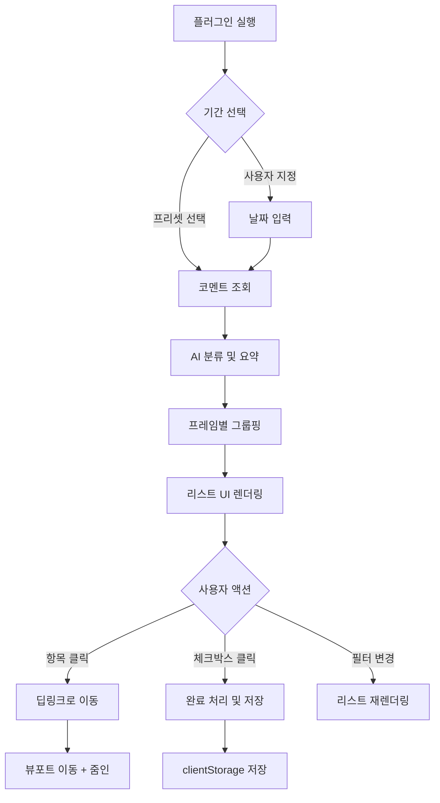

# Figma Comment Summarizer - PRD (기능 정의서)

> **목표**: 글로벌 프로젝트의 수많은 코멘트를 "액션 가능한(Actionable)" 정보로 변환하여, 시니어 UX 디자이너가 중요한 피드백을 놓치지 않도록 돕는다.

---

## 1. 기능 명세 (Feature Specification)

### 1.1 기간 설정 (Date Range Picker)

| 항목 | 설명 |
|------|------|
| **기본값** | 최근 24시간 |
| **프리셋 옵션** | `24시간` · `3일` · `1주일` · `사용자 지정` |
| **특수 옵션** | `마지막 확인 이후 (Since last check)` - 마지막 플러그인 실행 시점 기준 |
| **저장** | 마지막 선택 기간을 `clientStorage`에 저장하여 재실행 시 유지 |

---

### 1.2 스마트 요약 (AI Summarization)

#### 분류 카테고리

| 카테고리 | 뱃지 색상 | 설명 | 예시 키워드 |
|----------|-----------|------|-------------|
| 🔴 **Bug/Error** | `#E53935` | 버그 리포트, 오류 제보 | "깨짐", "안됨", "에러", "broken" |
| 🟠 **Change Request** | `#FB8C00` | 수정 요청, 변경 사항 | "수정해주세요", "변경", "바꿔주세요" |
| 🔵 **Question** | `#1E88E5` | 질문, 확인 요청 | "왜?", "어떻게?", "확인 부탁" |
| ⚪ **Discussion** | `#757575` | 일반 논의, 의견 공유 | 기타 |

#### 우선순위 플래그

| 우선순위 | 조건 | 표시 |
|----------|------|------|
| **긴급 (Urgent)** | `!`, `ASAP`, `urgent`, `긴급` 포함 | 🔴 빨간색 뱃지 + 상단 고정 |
| **일반** | 기본값 | 카테고리 색상 뱃지 |

#### AI 요약 출력 형식

```
[Change Request] Home 화면 - 헤더 영역
"로고 크기를 20% 줄여달라는 요청 (by @designer_kim)"
→ 원본 코멘트로 이동
```

#### AI 요약 카드 (Smart Summary Card)

각 프레임 그룹 상단에 해당 프레임의 **코멘트 대화를 한국어로 요약**하는 카드를 표시한다.

| 항목 | 설명 |
|------|------|
| **표시 위치** | 프레임 그룹 헤더 바로 아래 |
| **요약 언어** | 한국어 |
| **AI 모델** | Gemini 2.0 Flash |
| **호출 방식** | 프레임별 1회 호출 (배치 + 1초 딜레이) |

##### 요약 카드 구조

```text
📁 Home - Header (프레임명)
┌──────────────────────────────────────┐
│ 💡 핵심 주제 (15자 이내 타이틀)         │
│ 📌 주요 이슈: 로고 크기 축소 요청        │
│ 💬 논의: @navin이 20% 축소안 제시       │
│ ✅ 결정: 20% 축소로 확정, 반영 완료      │
│ ⚠️ 미해결: 모바일 버전 별도 검토 필요     │
└──────────────────────────────────────┘
▼ 코멘트 5건 (접기/펼치기)
```

##### 요약 프롬프트

```
아래는 Figma 프레임 "{frameName}"에 달린 코멘트 대화입니다.
이 대화를 분석하여 한국어로 정리해주세요.

[코멘트 목록 JSON]

다음 JSON 형식으로만 응답:
{
  "title": "핵심 주제 (15자 이내)",
  "issues": ["주요 이슈"],
  "discussion": ["논의 내용"],
  "decisions": ["결정/할 일"],
  "unresolved": ["미해결 사항"]
}
```

---

### 1.3 맥락 기반 그룹핑 (Context Grouping)

- **그룹 단위**: 상위 프레임(Frame) 또는 페이지 기준
- **정렬 기준**: 코멘트 수 > 최신순
- **접기/펼치기**: 각 그룹은 아코디언 방식으로 접기 가능

#### 그룹 헤더 표시 예시

```
📁 Home 화면
   ├─ 🟠 Change Request: 3건
   ├─ 🔵 Question: 1건
   └─ 총 4건의 코멘트

📁 Settings 화면
   └─ 🔵 Question: 1건
```

---

### 1.4 딥링크 (Deep Link to Comment)

| 동작 | 설명 |
|------|------|
| **클릭 트리거** | 요약 항목 또는 "원본으로 이동" 버튼 클릭 |
| **뷰포트 이동** | `figma.viewport.scrollAndZoomIntoView([node])` |
| **줌 레벨** | 코멘트가 포함된 노드가 화면 중앙에 적절한 크기로 표시 |
| **코멘트 하이라이트** | (선택) 네이티브 코멘트 패널 열기 불가 시, 별도 표시 |

---

### 1.5 체크리스트 (To-Do List)

| 기능 | 설명 |
|------|------|
| **체크박스** | 각 요약 항목에 체크박스 제공 |
| **상태 저장** | 체크 상태를 `clientStorage`에 저장 (코멘트 ID 기준) |
| **필터** | `전체 보기` · `미완료만 보기` 토글 |
| **초기화** | "모두 미완료로 되돌리기" 버튼 |

---

## 2. 유저 플로우 (User Flow)



---

## 3. 필요한 API

### 3.1 Figma Plugin API

| API | 용도 | 문서 |
|-----|------|------|
| `figma.currentPage.findAll()` | 페이지 내 모든 노드 탐색 | [링크](https://www.figma.com/plugin-docs/api/nodes/) |
| `figma.viewport.scrollAndZoomIntoView()` | 딥링크 구현 | [링크](https://www.figma.com/plugin-docs/api/figma-viewport/) |
| `figma.clientStorage.getAsync/setAsync` | 로컬 상태 저장 | [링크](https://www.figma.com/plugin-docs/api/figma-clientStorage/) |
| `figma.showUI()` | UI 패널 표시 | [링크](https://www.figma.com/plugin-docs/api/figma-ui/) |

### 3.2 Figma REST API (코멘트 조회)

| Endpoint | Method | 용도 |
|----------|--------|------|
| `GET /v1/files/:file_key/comments` | GET | 파일의 모든 코멘트 조회 |

#### 요청 예시
```bash
curl -H "X-Figma-Token: <ACCESS_TOKEN>" \
  "https://api.figma.com/v1/files/<FILE_KEY>/comments"
```

#### 응답 구조 (주요 필드)
```json
{
  "comments": [
    {
      "id": "12345",
      "message": "로고 크기를 줄여주세요",
      "created_at": "2026-02-03T10:00:00Z",
      "resolved_at": null,
      "user": { "handle": "designer_kim" },
      "client_meta": { "node_id": "1:234", "node_offset": { "x": 100, "y": 200 } }
    }
  ]
}
```

> ⚠️ **주의**: REST API 사용을 위해 Personal Access Token 또는 OAuth 인증 필요

### 3.3 AI API (요약 및 분류)

| 옵션 | 설명 |
|------|------|
| **OpenAI API** | GPT-4o-mini 권장 (비용 효율적) |
| **프롬프트 예시** | 아래 참조 |

#### 분류 프롬프트 예시

```
다음 Figma 코멘트를 분석하여 JSON으로 분류해주세요.

코멘트: "{comment_text}"

분류 기준:
- category: "bug" | "change_request" | "question" | "discussion"
- priority: "urgent" | "normal"
- summary: 한 줄 요약 (20자 이내)

JSON 형식으로만 응답:
```

---

## 4. 시스템 아키텍처

### 4.1 하이브리드 모델 (무료 티어 + BYOK)

사용자에게 API 키 입력 부담을 줄이면서, 비용을 제어할 수 있는 하이브리드 구조를 채택합니다.

```
┌─────────────────────────────────────────────────────────────┐
│                      사용자 플러그인                          │
├──────────────────────────┬──────────────────────────────────┤
│     🆓 무료 모드          │        🔑 BYOK 모드              │
│  (월 50회 제한)           │      (무제한)                    │
│                          │                                  │
│  - Figma OAuth 로그인     │  - 사용자가 직접 입력한          │
│  - Proxy 서버 경유        │    OpenAI API Key               │
│  - 사용량 카운팅          │  - 직접 OpenAI 호출              │
└────────────┬─────────────┴──────────────┬───────────────────┘
             │                            │
             ▼                            ▼
┌────────────────────────┐    ┌────────────────────────────────┐
│   Cloudflare Workers   │    │        OpenAI API 직접 호출     │
│   (Proxy Server)       │    │                                │
│                        │    │                                │
│  - 내 OpenAI Key 보관   │    │                                │
│  - 사용자별 횟수 카운팅  │    │                                │
│  - 월 $50 한도 설정     │    │                                │
└────────────┬───────────┘    └────────────────────────────────┘
             │
             ▼
┌────────────────────────┐
│      OpenAI API        │
│    (GPT-4o-mini)       │
└────────────────────────┘
```

### 4.2 모드별 비교

| 항목 | 🆓 무료 모드 | 🔑 BYOK 모드 |
|------|-------------|--------------|
| **사용량** | 월 50회 | 무제한 |
| **API 키** | 불필요 (서버 보관) | 사용자 직접 입력 |
| **인증** | Figma OAuth 로그인 | Personal Access Token |
| **비용** | 무료 | 사용자 부담 |
| **서버 의존** | 있음 | 없음 |

### 4.3 비용 제어

| 항목 | 설정 |
|------|------|
| **월간 예산 한도** | $50 (OpenAI Dashboard에서 설정) |
| **무료 사용 한도** | 사용자당 월 50회 |
| **한도 초과 시** | 503 에러 + "BYOK 모드로 전환하세요" 안내 |

### 4.4 기술 스택

| 영역 | 기술 |
|------|------|
| **플러그인 코드** | TypeScript |
| **UI** | HTML + Vanilla CSS + JavaScript |
| **상태 저장** | Figma `clientStorage` |
| **코멘트 조회** | Figma REST API |
| **AI 분류** | OpenAI API (GPT-4o-mini) |
| **Proxy 서버** | Cloudflare Workers (무료 티어) |
| **사용량 저장** | Cloudflare KV Storage |
| **빌드** | TypeScript Compiler (`tsc`) |

---

## 5. MVP 범위

> [!IMPORTANT]
> **1차 MVP에서 제외할 기능** (추후 확장)
> - OAuth 인증 (1차에서는 Personal Access Token 수동 입력)
> - 실시간 코멘트 동기화
> - 다국어 지원 (1차에서는 한/영 혼용)

### MVP 체크리스트

- [x] 기간 선택 (프리셋 3종 + Since last check)
- [x] 코멘트 조회 (REST API)
- [x] AI 분류 (4개 카테고리)
- [x] 프레임별 그룹핑
- [x] 딥링크 (Zoom to comment)
- [x] 체크박스 + 로컬 저장

---

## 6. 구현 로드맵

### Phase 1: 플러그인 핵심 기능 (서버 없이)

> **목표**: 사용자가 **자기 API 키(BYOK)**로 동작하는 MVP 완성

| 단계 | 작업 | 설명 |
|------|------|------|
| 1-1 | **code.ts 기본 로직** | UI ↔ 플러그인 메시지 통신, clientStorage 저장 |
| 1-2 | **Figma REST API 연동** | 사용자 토큰으로 코멘트 조회 |
| 1-3 | **OpenAI API 연동** | 사용자 키로 코멘트 분류/요약 |
| 1-4 | **UI 렌더링** | 분류된 코멘트를 리스트로 표시 |
| 1-5 | **딥링크 구현** | 클릭 시 해당 위치로 줌인 이동 |

---

### Phase 2: 백엔드 서버 구축

> **목표**: 무료 티어 제공을 위한 Proxy 서버

| 단계 | 작업 | 설명 |
|------|------|------|
| 2-1 | **Cloudflare Workers 세팅** | 기본 엔드포인트 생성 |
| 2-2 | **OpenAI Proxy 구현** | 서버에서 OpenAI 호출 |
| 2-3 | **사용량 카운팅** | KV Storage로 사용자별 횟수 저장 |
| 2-4 | **한도 체크 로직** | 월 50회 초과 시 차단 |

---

### Phase 3: Figma OAuth 통합

> **목표**: 로그인만으로 자동 토큰 발급 + 사용자 식별

| 단계 | 작업 | 설명 |
|------|------|------|
| 3-1 | **Figma App 등록** | Figma Developers Console |
| 3-2 | **OAuth 플로우 구현** | 로그인 → 토큰 발급 |
| 3-3 | **사용자 식별 연동** | Figma User ID로 사용량 트래킹 |

---

### Phase 4: 고도화 & 출시

> **목표**: 안정성 확보 및 배포

| 단계 | 작업 | 설명 |
|------|------|------|
| 4-1 | **에러 핸들링** | 네트워크 오류, API 한도 초과 등 |
| 4-2 | **로딩/상태 UI** | 스켈레톤, 에러 메시지 등 |
| 4-3 | **Figma Community 제출** | 플러그인 스토어 등록 |

